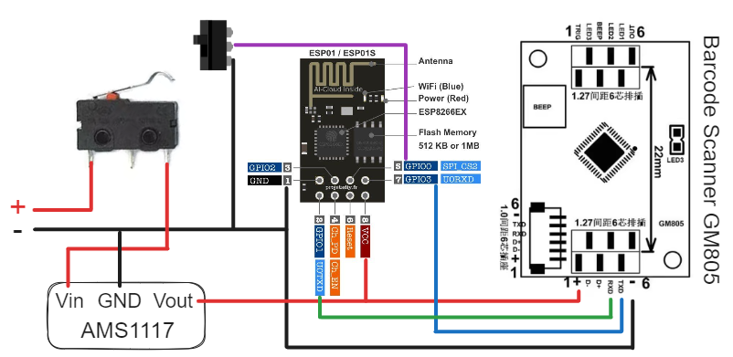
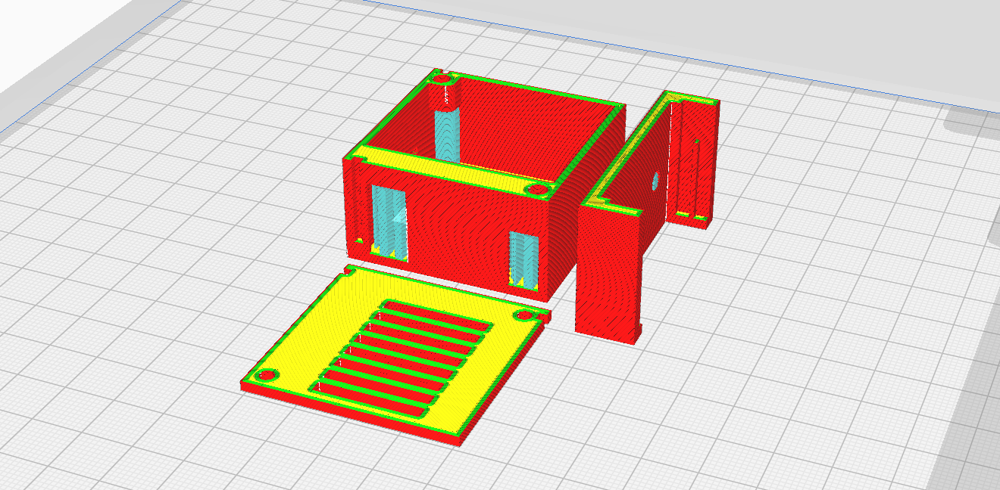

# 特性

- 条码识别,支持国产商品与进口产品;
- Grocy物品扫码出库;
- Grocy已有物品扫码入库,新物品自动获取商品详情并入库;(商品详情包括:条码,基础信息,图片,GPC类别,保质期判别等)

# 快速开始

Grocy配置,Web界面中:
- `设置`-`管理API密钥`-`添加`
- `管理主数据`-`位置`- 根据自身情况添加
- `管理主数据`- `自定义字段`- `添加`- 表单信息:实体:products;名称GDSInfo;标题:GDSInfo;类型:单行文本,勾选"在表格中显示此列"
- 配置`数量单位`：`数量单位`-`添加`

```shell
docker pull osnsyc/grocycompanioncn:latest
```

创建 config.ini 和 docker-compose.yml 文件

```ini
# config.ini
[Grocy]
GROCY_URL = http://EXAMPLE.COM
GROCY_PORT = 443
GROCY_API = YOUR_GROCY_API_KEY
# GROCY_DEFAULT_QUANTITY_UNIT_ID 在 shell内获取:
; curl -X 'GET' 'https://EXAMPLE.COM:PORT/api/objects/quantity_units' \  -H 'accept: application/json' \  -H 'GROCY-API-KEY:YOUR_GROCY_API_KEY' \  | echo -e "$(cat)"
GROCY_DEFAULT_QUANTITY_UNIT_ID = 1  # 默认的数量单位ID
GROCY_DEFAULT_BEST_BEFORE_DAYS = 365  # 默认的保质期天数
# 存储位置ID,与scanner.ino内的位置名称对应
# shell内获取,替换以下地址\端口\api_key:
; curl -X 'GET' 'https://EXAMPLE.COM:PORT/api/objects/locations' \
; -H 'accept: application/json' \
; -H 'GROCY-API-KEY:YOUR_GROCY_API_KEY' \
; | echo -e "$(cat)"
[GrocyLocation]
pantry = 1
temporary_storage = 2
fridge = 3
living_room = 4
bedroom = 5
bathroom = 6
# 注册RapidAPI账号，并在https://rapidapi.com/Glavier/api/barcodes1/的Pricing点击订阅（免费），复制Endpoints中的X_RapidAPI_Key于此处
[RapidAPI]
X_RapidAPI_Key = YOUR_RapidAPI_API_KEY
```
其中，`GROCY_DEFAULT_QUANTITY_UNIT_ID`的获取方法:
```shell
curl -X 'GET' 'https://EXAMPLE.COM:PORT/api/objects/quantity_units' \
  -H 'accept: application/json' \
  -H 'GROCY-API-KEY:YOUR_GROCY_API_KEY' \
  | echo -e "$(cat)"
```

其中，`GrocyLocation`id的获取方法:
```shell
curl -X 'GET' 'https://EXAMPLE.COM:PORT/api/objects/locations' \
-H 'accept: application/json' \
-H 'GROCY-API-KEY:YOUR_GROCY_API_KEY' \
| echo -e "$(cat)"
```

```yml
# docker-compose.yml
version: "3"
services:
  spider:
    image: osnsyc/grocycompanioncn:latest
    restart: always
    ports:
      - "9288:9288"
    volumes:
      - ./config.ini:/usr/src/app/config.ini
      # - ./u2net.onnx:/root/.u2net/u2net.onnx
    networks:
      - grocy_cn_campanion

networks:
  grocy_cn_campanion:
```

`u2net.onnx`为rembg的模型,程序第一次运行时会自动下载,下载缓慢的也可[手动下载](https://github.com/danielgatis/rembg/releases/download/v0.0.0/u2net.onnx),放入`docker-compose.yml`同目录,并反注释以下一行
```yml
 - ./u2net.onnx:/root/.u2net/u2net.onnx
```
```shell
docker compose up -d
```

打开`http://127.0.0.1:9288`,看到页面显示`GrocyCNCompanion Started!`,服务已成功运行.

GrocyCompanionCN api测试

```shell
curl -X POST -H "Content-Type: application/json" -d '{"client":"temporary_storage","aimid":"]E0","barcode":"8935024140147"}' http://127.0.0.1:9288/add
```

刷新Grocy,出现新物品

# 硬件

条码/二维码扫描模块为GM805,带蜂鸣器和灯光,3.3V供电

https://img.alicdn.com/imgextra/i3/343151/O1CN01QbKGVt1Z9CkLwAzKp_!!343151.jpg

使用模块包括:
- GM805
- ESP01
- AMS1117
- 限位开关
- 3.7V锂电池

以下为硬件接线示意图




## 程序烧录

完成以下设置并烧入ESP01
```c
// ./esp8266/BarcodeScanner.ino
#include <ESP8266WiFi.h>
#include <ESP8266HTTPClient.h>

#define SERVER "http://YOUR_SEVER_IP:9288" //GrocyCompanionCN api的地址
#define CLIENT "temporary_storage" //对应config.ini中GrocyLocation的值
#define GPIO0_PIN 0
#define LED_PIN 2 
#define HTTP_CODE_OK 200
#ifndef STASSID
#define STASSID "YOUR_SSID"  //WiFi名
#define STAPSK "YOUR_PASSWORD" //WiFi密码
#endif
```
## 扫码模块的设置

使用模块直接扫描以下二维码设置，设置成功，发出蜂鸣。

### 添加AIM ID（必选）


### 添加串口输出（必选）


### 照明(自选)


## 扫码模块测试

- 切换拨动开关至“出库”模式；（必须为“出库”模式才可正常启动）
- 模块上电自动启动，并发出蜂鸣声,蓝灯亮起；
- WiFi连接成功，蓝灯熄灭；
- 扫码成功，模块发出蜂鸣声；
- 请求成功，模块蓝灯常亮0.5秒后熄灭；
- 请求错误，模块蓝灯连续闪烁2秒；
- 按下微动开关，模块断电；
- 切换拨动开关，切换“出库”和“入库”模式；

## 壳体



## 物料清单与参考链接


| 序号 | 名称         | 参考链接                                                                                                                                                        |
| ---- | ------------ | --------------------------------------------------------------------------------------------------------------------------------------------------------------- |
| 1    | GM805        | [颜色分类：默认](https://item.taobao.com/item.htm?_u=pnh8ujp653f&id=670772947536&spm=a1z09.2.0.0.63572e8d9a6VqT)                                                |
| 2    | ESP01        | [颜色分类：ESP-01S](https://item.taobao.com/item.htm?_u=pnh8ujp6e5a&id=664680861283&spm=a1z09.8149145.0.0.3de7269aKjcPDW)                                       |
| 3    | AMS1117      | [颜色分类：AMS1117-3.3模块 3脚](https://detail.tmall.com/item.htm?_u=pnh8ujp8a63&id=650922269502&spm=a1z09.2.0.0.63572e8dhXa8kZ)                                |
| 4    | 拨动开关     | [颜色分类：柄高4mm](https://detail.tmall.com/item.htm?_u=pnh8ujpab3e&id=679299103183&spm=a1z09.2.0.0.63572e8dhXa8kZ)                                            |
| 5    | 限位开关     | [颜色分类：KW12 3脚21mm圆弧柄](https://detail.tmall.com/item.htm?_u=pnh8ujp3181&id=706873714470&spm=a1z09.2.0.0.63572e8dhXa8kZ)                                           |
| 6    | 3.7V锂电池   | [颜色分类：3.7V并联加厚600mAh/XH2.54反向插](https://item.taobao.com/item.htm?_u=pnh8ujp152e&id=643433296669&spm=a1z09.2.0.0.63572e8d9a6VqT&skuId=4799818249667) |
| 7    | 锂电池充电器 | [颜色分类：500mA/XH2.54反向母插转换头](https://item.taobao.com/item.htm?_u=pnh8ujp28f4&id=16985757260&skuId=3484166170023&spm=a1z09.2.0.0.63572e8d9a6VqT)       |
| 8    | PCB跳线      |                                                                                                                                                                 |
| 9    | PCB洞洞板    | [颜色分类：双面喷锡 2x8cm](https://detail.tmall.com/item.htm?_u=pnh8ujp1c7f&id=667259213547&spm=a1z09.2.0.0.63572e8dhXa8kZ)                                     |
| 10     |  ESP烧录器            |           [颜色分类：ESP-01/01S CH340芯片](https://item.taobao.com/item.htm?_u=pnh8ujp6e5a&id=664680861283&skuId=4961471522476&spm=a1z09.2.0.0.67002e8dPzgKnw)                                                                                                                                                      |
| 11   | 注塑铜螺母   | [颜色分类：M2x4x3.5](https://detail.tmall.com/item.htm?_u=tnh8ujp4e44&id=673367228604&spm=a1z09.2.0.0.3ab22e8dJ2V8vu)                                           |
| 12     |    螺丝          |     M2x6                                                                                                                                                            |
# 鸣谢

- https://github.com/tenlee2012/BarCodeQuery
